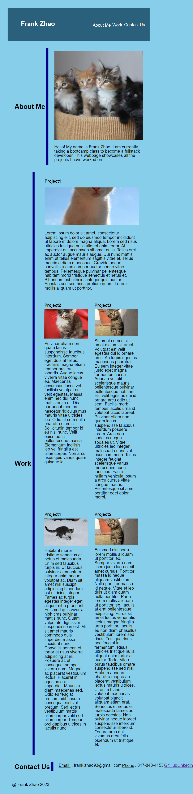

# Portfolio

## Description
This portfolio webpage consists a collection of my best work.  I built this so an employer can view it and decide if I will be a good candidate for an open position. 

## Installation
N/A

## Usage
The portfolio webpage can be accessed with this URL link: https://fzhao888.github.io/Portfolio/ .  In the nav bar, the employer can select about me, work, or contact us.  Depending on which option the employer selected, it will take the employer to their desired section.  In the contact us section, I provided my email, phone number, a link to my GitHub, and a link to my Linkedin as forms of contact.

In addition, the employer can view the deployed application by clicking on its respective project image. 

In addition, the employer can view the deployed application by clicking on its respective project image.

Here is a screenshot of the webpage:

## Credits
For the header and the media query, I looked at the exercise code we did in class for the University of Minnesota bootcamp.

## License
MIT License
